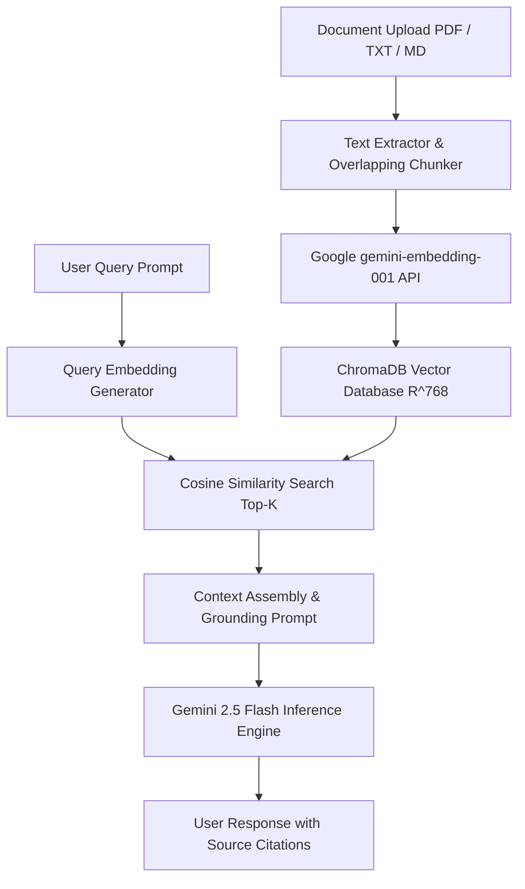

# Gemini Document Intelligence Dashboard: A Retrieval-Augmented Generation Architecture

An end-to-end full-stack Retrieval-Augmented Generation (RAG) system built to evaluate real-time document chunking, vector embedding search, and grounded language model inference. The platform allows users to upload unstructured text, Portable Document Format (PDF), and Markdown files for session-based vector indexing and query-answering with verifiable source attribution.

---

## Abstract

Standard large language models (LLMs) are constrained by fixed parametric knowledge and context window limits. This project implements a local RAG pipeline using FastAPI, ChromaDB, and Google's Gemini 2.5 Flash API. Documents uploaded during a session are parsed, split into overlapping text windows, and embedded into a 768-dimensional vector space using the `gemini-embedding-001` model. Upon receiving a natural language prompt, the system executes cosine similarity search in ChromaDB to retrieve the top $K$ relevant passages and passes them as grounding context to the language model, minimizing hallucination and maintaining precise document citations.

---

## System Architecture



---

## Mathematical Framework

### 1. Vector Space Mapping
Given a text chunk $T_i$, the embedding function $f$ maps $T_i$ into a continuous 768-dimensional vector space:

$$f: T_i \longrightarrow \vec{v}_i \in \mathbb{R}^{768}$$

Where:

$$\vec{v}_i = \begin{bmatrix} v_{i,1} \\ v_{i,2} \\ \vdots \\ v_{i,768} \end{bmatrix}$$

### 2. Similarity Metric
Given a user query vector $\vec{q}$ and document chunk vector $\vec{d}_i$, similarity is evaluated using the Cosine Similarity metric:

$$\text{Sim}(\vec{q}, \vec{d}_i) = \cos(\theta) = \frac{\vec{q} \cdot \vec{d}_i}{\|\vec{q}\| \|\vec{d}_i\|} = \frac{\sum_{k=1}^{768} q_k d_{i,k}}{\sqrt{\sum_{k=1}^{768} q_k^2} \sqrt{\sum_{k=1}^{768} d_{i,k}^2}}$$

The metric yields values in the range $[-1, 1]$, where values closer to $1.0$ indicate high semantic alignment.

### 3. Nearest Neighbor Selection ($K$-NN)
The retrieval component selects the top $K=3$ candidate passages solving the optimization:

$$\text{Top-}K = \arg\max_{d_i \in \mathcal{D}}^{(K)} \text{Sim}(\vec{q}, \vec{d}_i)$$

Using ChromaDB's Hierarchical Navigable Small World (HNSW) graph indexing, candidate search is executed in $O(\log N)$ average time complexity.

### 4. Overlapping Windowing
To preserve sentence structure at chunk boundaries, documents of length $M$ are segmented using a sliding window with chunk size $L = 500$ characters and overlap $O = 100$ characters:

$$C = \left\lceil \frac{M - O}{L - O} \right\rceil = \left\lceil \frac{M - 100}{400} \right\rceil$$

---

## Tech Stack & Dependencies

- Backend Framework: FastAPI (ASGI Python 3.12 Server)
- Vector Store: ChromaDB (Local Persistent Client)
- Embedding Model: Google `gemini-embedding-001`
- Generative LLM: Google `gemini-2.5-flash` (with automated fallback to `gemini-1.5-flash`)
- PDF Parsing: `pypdf`
- Frontend Interface: Vanilla HTML5, CSS3 Glassmorphism, JavaScript (ES6+), Marked.js

---

## Setup & Running Locally

### 1. Repository Setup
```bash
git clone https://github.com/azimsaidov/gemini-rag-dashboard.git
cd gemini-rag-dashboard

python3 -m venv venv
source venv/bin/activate
pip install -r requirements.txt
```

### 2. Environment Configuration
Create a `.env` file in the root directory and supply your Google AI Studio API key:

```env
GEMINI_API_KEY=your_gemini_api_key_here
```

### 3. Execution
Start the local FastAPI ASGI server:

```bash
python app.py
```

Access the web portal at `http://127.0.0.1:8000`.

---

## License

MIT License. See `LICENSE` for details.
