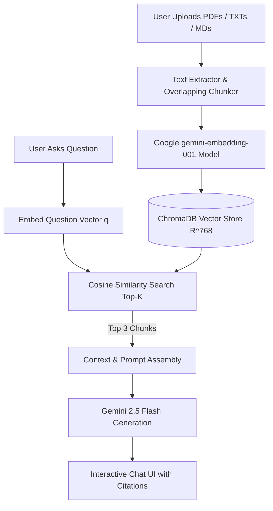

# ✨ Gemini Document Intelligence Dashboard (RAG & Vector Search)

[](https://python.org)
[](https://fastapi.tiangolo.com)
[](https://aistudio.google.com)
[](https://trychroma.com)
[](https://opensource.org/licenses/MIT)

A high-performance, full-stack **Retrieval-Augmented Generation (RAG)** web dashboard. Upload session documents (PDF, TXT, Markdown) to index them into a high-dimensional vector database (ChromaDB) and chat in real-time with grounded AI responses backed by precise document citations.

---

## 🌟 Key Features

- **📂 Session Drag-and-Drop Ingestion**: Upload PDF, TXT, or Markdown files directly from the browser.
- **⚡ Vector Similarity Search**: Powered by Google's `gemini-embedding-001` (768-dimensional space) and ChromaDB vector store.
- **💬 Grounded AI Generation**: Answers are synthesized exclusively from retrieved document context using `gemini-2.5-flash` with automatic fallback to `gemini-1.5-flash`.
- **📌 Interactive Citations**: Every response includes clickable source pills displaying exact document names and chunk indices.
- **🎨 Glassmorphism UI**: Dark mode dashboard built with modern HTML5, CSS3, and Vanilla JavaScript.

---

## 📐 System Architecture



---

## 🧮 Mathematical Blueprint

### 1. Vector Embeddings ($\mathbb{R}^{768}$)
Each text chunk is mapped into a 768-dimensional latent semantic space:
$$f: \text{Text Chunk} \longrightarrow \vec{v} \in \mathbb{R}^{768}$$

### 2. Cosine Similarity Metric
Retrieval distance between query vector $\vec{q}$ and document chunk vector $\vec{d}$ is computed as:
$$\text{Cosine Similarity}(\vec{q}, \vec{d}) = \cos(\theta) = \frac{\vec{q} \cdot \vec{d}}{\|\vec{q}\| \|\vec{d}\|} = \frac{\sum_{i=1}^{768} q_i d_i}{\sqrt{\sum_{i=1}^{768} q_i^2} \sqrt{\sum_{i=1}^{768} d_i^2}}$$

### 3. $K$-NN Optimization
ChromaDB selects the top $K=3$ document chunks solving:
$$\text{Top-}K = \arg\max_{d_i \in \text{DB}}^{(K)} \text{Sim}(\vec{q}, \vec{d}_i)$$

---

## 🚀 Quickstart Guide

### Prerequisites
- Python 3.10+
- Free Google AI Studio API key ([aistudio.google.com](https://aistudio.google.com/))

### 1. Clone & Set Up Environment
```bash
git clone https://github.com/YOUR_USERNAME/gemini-rag-dashboard.git
cd gemini-rag-dashboard

python3 -m venv venv
source venv/bin/activate
pip install -r requirements.txt
```

### 2. Configure API Key
Copy `.env.example` to `.env` and add your free Gemini API key:
```bash
cp .env.example .env
```
In `.env`:
```env
GEMINI_API_KEY=your_google_ai_studio_key_here
```

### 3. Run Web Dashboard
```bash
python app.py
```
Open **`http://127.0.0.1:8000`** in your browser!

---

## 📁 Repository Structure

```text
gemini-rag-dashboard/
├── app.py                 # FastAPI backend server & REST API endpoints
├── static/                # Glassmorphism UI Frontend
│   ├── index.html         # Dashboard layout & structure
│   ├── style.css          # CSS3 glassmorphism styles & animations
│   └── script.js          # Asynchronous upload & chat client logic
├── requirements.txt       # Dependencies (FastAPI, Google GenAI, ChromaDB, PyPDF)
├── .env.example           # Environment template
└── README.md              # Project documentation & architecture
```

---

## 📜 License
Distributed under the MIT License. See `LICENSE` for more information.
